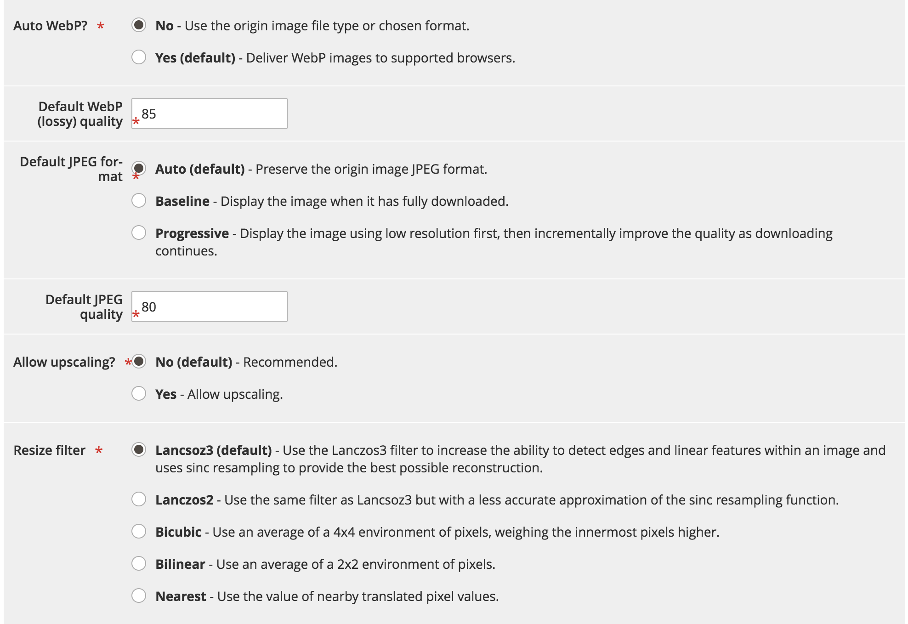

# Snelle optimalisatie van afbeeldingen

Snelle optimalisatie van afbeeldingen (Fastly IO) biedt realtime beeldbewerking en optimalisatie om de levering van afbeeldingen te versnellen en het onderhoud van sets met afbeeldingsbronnen voor responsieve webtoepassingen te vereenvoudigen. Zodra gevormde Fastly IO de volgende eigenschappen van de beeldoptimalisering verstrekt:

- Omzetting met verlies forceren
- Diepe optimalisatie van afbeeldingen
- Aangepaste pixelverhoudingen
- Ondersteuning voor algemene afbeeldingsindelingen: PNG, JPEG, GIF en WebP

Alvorens u toelaat en de Fastly optie IO vormt, moet u opstelling uw Snelle dienst en vormt de Beveiliging van de Oorsprong.

Op basis van uw configuratie-instellingen voegt het fragment Fastly Image Optimization (Fastly IO) de VCL-code in om de beeldoptimalisatie uit te voeren, waardoor de levering van productafbeeldingen in de winkel sneller verloopt. Er zijn drie stappen om Fastly IO te vormen: toelaten, vormen, en verifieer.

## SNELLE IO inschakelen

Schakel Fastly Image Optimization (Fastly IO) in vanuit het deelvenster Beheer door het fragment Fastly IO VCL te uploaden. Het fragment bevat de instructies voor een snelle configuratie voor het verwerken van alle afbeeldingen met behulp van standaardconfiguraties.

**Vereisten:**

- Installeren of upgraden naar Fastly-module versie 1.2.62 of hoger
- [Scherm met snelle oorsprong en backend configureren](fastly-custom-cache-configuration.md#configure-back-ends-and-origin-shielding)

**Fastly IO inschakelen**:

1. Aanmelden bij uw lokale [Beheerder](../../get-started/onboarding.md#access-your-admin-panel) als beheerder.

1. Selecteren **Winkels** > **Instellingen** > **Configuratie** > **Geavanceerd** > **Systeem**.

1. Vouw in het rechterdeelvenster uit **Volledige paginacache**.

1. Selecteren **Snelle configuratie** > **Afbeelding optimaliseren** om de configuratie-instellingen op te geven.

1. In de _Fastly IO, fragment_ veld, selecteren **In-/uitschakelen**.

1. Upload het fragment Fastly IO:

   - Selecteren **Standaardopties voor IO-configuratie** om de standaardpagina met configuratieopties voor optimalisatie van afbeelding te openen.
   - Selecteren **Uploaden** om het VCL-fragment naar uw server te uploaden.

## SNELLE IO configureren

Controleer en werk zo nodig de standaard IO-configuratie-instellingen voor optimalisatie van afbeeldingen bij. U kunt bijvoorbeeld WebP- en JPEG-kwaliteitsniveaus wijzigen voor indeling met verlies of de indeling wijzigen voor het weergeven van JPEG-afbeeldingen in _Progressief_ of _Basislijn_. Bovendien kunt u de snelste IO gebruiken voor meer functies voor het optimaliseren van afbeeldingen, zoals:

- Omzetting met verlies forceren
- Diepe optimalisatie van afbeeldingen
- Aangepaste pixelverhoudingen

**IO snel bijwerken**:

1. Op de _Snelle configuratie_ pagina in de _Standaardopties voor IO-configuratie_ veld, selecteren **Configureren**.

   

1. Controleer en werk de Fastly IO configuratie montages op de _Standaardconfiguratieopties voor optimalisatie van afbeeldingen_ pagina:

   

   - **Auto WebP?**—laat de standaardinstelling ongewijzigd (`Yes`) om afbeeldingen om te zetten in de WebP-indeling in browsers die deze ondersteunen. Als u de instelling wijzigt in **Nee** In Fastly wordt het afbeeldingsbestandstype gebruikt in plaats van de afbeelding om te zetten in de WebP-indeling.

   - **Standaardkwaliteit van WebP (met verlies)**—laat de standaardinstelling ongewijzigd (`85`) of typt u het compressieniveau voor afbeeldingen met een bestandsindeling met verlies. U kunt een geheel getal tussen 1 en 100 opgeven.

   - **Besturingselementen voor de standaardindeling JPEG** — laat de standaardinstelling (`Auto`) of selecteert u het type JPEG dat u wilt gebruiken wanneer u een afbeelding aanbiedt. Als de waarde is ingesteld op _Automatisch_, levert Fastly afbeeldingen met het uitvoertype dat overeenkomt met het invoertype. Selecteren _Basislijn_ om de afbeeldingen regel voor regel weer te geven, beginnend van linksboven naar rechtsonder. Selecteren _Progressief_ om een vage afbeelding weer te geven die tijdens het laden wordt gewist.

   - **Standaardkwaliteit JPEG**—laat de standaardinstelling ongewijzigd (`85`) of typt u het compressieniveau voor de kwaliteit van bestandsindelingen met verlies. Geef een geheel getal op tussen 1 en 100.

   - **Upscaling toestaan?**—standaardinstelling verlaten (`No`), of selecteer `Yes` om afbeeldingen te retourneren die groter zijn dan het oorspronkelijke bronbestand, zodat ze binnen de gewenste afmetingen passen.

   - **Formaat wijzigen, filter**—laat de standaardinstelling ongewijzigd (`Lancsoz3`) of selecteer een alternatief. Met deze instelling geeft u aan welk filter wordt gebruikt voor het leveren van een afbeelding waarvan de grootte is gewijzigd. Afhankelijk van het geselecteerde filter kan het gewijzigde formaat van de afbeelding een hoger of lager aantal pixels hebben.

      - `Lanczos3` (standaard) - Levert de afbeelding van de beste kwaliteit. Hierdoor wordt de mogelijkheid vergroot om randen en lineaire kenmerken in een afbeelding te detecteren en wordt _[!DNL sinc]_het aantal pixels wijzigen om de wederopbouw zo goed mogelijk te laten verlopen.
      - `Lanczos2`—Hiermee wordt hetzelfde filter gebruikt als `Lancsoz3` maar met een minder nauwkeurige benadering van de _[!DNL sinc]_resamplingfunctie.
      - `Bicubic`—Heeft een natuurlijk verscherpingseffect wanneer u een afbeelding kleiner maakt.
      - `Bilinear`—Heeft een natuurlijk vloeiend effect wanneer u een afbeelding groter maakt.
      - `Nearest`—Heeft een natuurlijk pixeleffect bij het vergroten of verkleinen van pixelillustraties.

1. Nadat u de IO configuratie montages voor de Snelle dienst specificeert, selecteer **Annuleren** om terug te keren naar de instellingen voor snelle configuratie.

1. In de configuratie voor optimalisatie van afbeeldingen _Diepgaande optimalisatie van afbeeldingen inschakelen_ veld, selecteren **Ja** om uitgebreide optimalisatie van afbeeldingen in te schakelen.

   

   Diepe optimalisatie van afbeeldingen is standaard uitgeschakeld. Als deze functie is ingeschakeld, wordt de ingebouwde functie voor het aanpassen van de grootte in Adobe Commerce uitgeschakeld en wordt het vergroten of verkleinen van de grootte overgelaten aan de Fastly IO-service. Optimalisatie van afbeeldingen geldt alleen voor productafbeeldingen. De grootte van CMS-afbeeldingen wordt niet gewijzigd. Zie de [Snelle documentatie](#deep-image-optimization).

1. Nadat u een diepe optimalisatie van de afbeelding hebt ingeschakeld, schakelt u de optie [adaptieve pixelverhoudingen](#adaptive-pixel-ratios) functie voor het genereren van afbeeldingen die zijn geoptimaliseerd voor gebruik op responsieve websites.

   

   - In de _Pixelverhoudingen van adaptieve apparaten inschakelen_ veld, selecteren **Ja**.
   - In de _Pixelverhoudingen van apparaat_ , accepteert u de standaardinstelling of selecteert u de optie **Systeeminvoer** Schakel het selectievakje in om de instelling te verwijderen. Selecteer vervolgens de gewenste verhouding. Een hogere instelling voor pixelverhoudingen voor apparaten levert grotere afbeeldingen op.

1. Selecteren **Configuratie opslaan**.

### Omzetting met verlies forceren

Standaard dwingt de Fastly IO-service de conversie van verliesvrije indelingen zoals PNG, BMP of WEBP naar de indeling JPEG/WEBP.

Het voordeel van een gedwongen omzetting met verlies is dat kleinere afbeeldingen worden gebruikt.
Als u bijvoorbeeld de indeling JPEG of WEBp gebruikt in plaats van PNG, kan de grootte met 60 tot 70 procent worden verkleind, afhankelijk van het kwaliteitsniveau dat is opgegeven in de Fastly IO-configuratie.

Afhankelijk van het kwaliteitsniveau dat is geselecteerd voor optimalisatie van de afbeelding, kunnen er visuele verschillen in afbeeldingen optreden. Alpha kanaal/transparanties worden bijvoorbeeld verwijderd en vervangen door een witte achtergrond, tenzij u de optie Diepe afbeelding optimaliseren gebruikt en de achtergrondkleur van uw thema gebruikt.

Als u verliesconversie uitschakelt (`WebP Auto? = No`), wijzigt Fastly IO slechts JPEG beelden in formaat WEBP voor compatibele browsers. Er worden geen andere afbeeldingstypen gewijzigd. Als de oorspronkelijke afbeelding bijvoorbeeld PNG is, is de uitvoer van de service Fastly IO PNG.

### Diepe optimalisatie van afbeeldingen

Diepe optimalisatie van afbeeldingen is standaard uitgeschakeld. Als u deze optie inschakelt, wordt het formaat van de ingebouwde Adobe Commerce uitgeschakeld en wordt het volledig geoffload naar de Fastly IO-service.
Met deze functie wordt alleen het formaat gewijzigd _product_ afbeeldingen. De grootte van CMS-afbeeldingen wordt niet gewijzigd.

Als u uitgebreide optimalisatie van afbeeldingen inschakelt, voegt u een achtergrondkleurdefinitie toe aan elke afbeelding zoals die in uw thema is gedefinieerd. Het resultaat is dat WebP-afbeeldingen worden overgeschakeld van WebP-verlies naar WebP-verlies. Een van de belangrijkste verschillen tussen verliesloos en verlies is dat bij verlies het alfakanaal van PNG-afbeeldingen wordt verwijderd, wat veel kleinere afbeeldingen oplevert. Afbeeldingen met transparanties kunnen er echter vreemd uitzien op product- en campagnepagina&#39;s die een andere achtergrond gebruiken.

De volgende code vertegenwoordigt bijvoorbeeld de oorspronkelijke bron voor een afbeelding van het thema Luma:

```html

```

Wanneer de functie Fastly IO Deep image optimization is ingeschakeld, wordt de oorspronkelijke broncode voor de afbeelding herschreven, zoals in het volgende voorbeeld wordt getoond:

```html

```

### Aangepaste pixelverhoudingen

De functie Adaptieve pixelverhoudingen is handig voor het optimaliseren van afbeeldingen voor progressieve webtoepassingen. Hierdoor kunt u meerdere afbeeldingsgrootten en resoluties van één afbeeldingsbronbestand leveren door een `srcset` voor elke productafbeelding.

Wanneer de functie Aangepaste pixelverhoudingen is ingeschakeld, biedt de Fastly IO-service een afbeelding met een vaste breedte die zich aan variaties kan aanpassen `device-pixel-ratios`.
De service wijzigt bijvoorbeeld de definitie van de productafbeelding, zoals in het volgende voorbeeld wordt getoond:

```html

```

Zie `srcset` [browserondersteuning](https://caniuse.com/#feat=srcset) en [specificatie](https://html.spec.whatwg.org/multipage/embedded-content.html#attr-img-srcset).

## SNEL IO valideren

Nadat u I.O. toelaat en snel vormt, bevestig uw configuratie door de tests van de Webpaginasnelheid met en zonder Fastly toe te laten IO uit te voeren. Lees ook de afbeeldingen in uw winkel om de afbeeldingsgrootte en de weergave op problemen te controleren.
